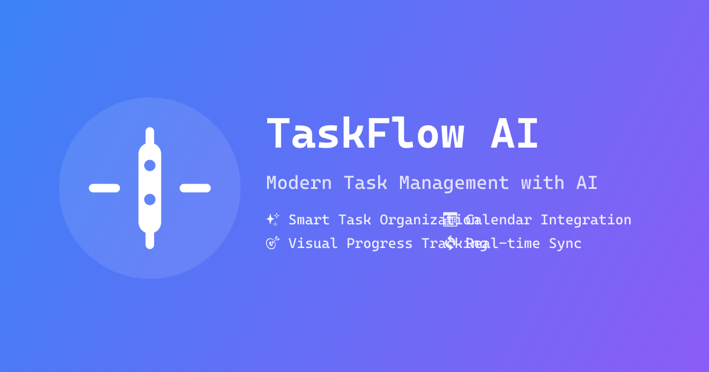

# TaskFlow AI

TaskFlow AI is a modern task management application built with Next.js 14, featuring a beautiful UI powered by Shadcn/UI and real-time data synchronization using Supabase.



## Features

- 📝 **Smart Task Management**: Create and organize tasks in stacks
- 🎯 **Progress Tracking**: Visual progress bars and completion status
- 📅 **Calendar Integration**: Schedule and track events with a built-in calendar
- 🕒 **Live Clock**: Beautiful animated clock with date display
- 🌤️ **Weather Updates**: Real-time weather information
- 🔄 **Real-time Sync**: Instant updates across all devices
- 🎨 **Dark/Light Mode**: Beautiful themes for any time of day
- 🔒 **Secure Authentication**: Powered by Supabase Auth

## Tech Stack

- **Frontend**:
  - Next.js 14 (App Router)
  - React
  - TypeScript
  - Tailwind CSS
  - Shadcn/UI Components
  - Lucide Icons
  - Framer Motion

- **Backend**:
  - Supabase (Database & Auth)
  - PostgreSQL
  - Row Level Security

## Getting Started

### Prerequisites

- Node.js 18+ 
- npm or pnpm
- Supabase account

### Installation

1. Clone the repository:
```bash
git clone https://github.com/yourusername/taskflow-ai.git
cd taskflow-ai
```

2. Install dependencies:
```bash
npm install
# or
pnpm install
```

3. Set up environment variables:
Create a `.env` file in the root directory with the following:
```env
NEXT_PUBLIC_SUPABASE_URL=your_supabase_url
NEXT_PUBLIC_SUPABASE_ANON_KEY=your_supabase_anon_key
```

4. Run the development server:
```bash
npm run dev
# or
pnpm dev
```

5. Open [http://localhost:3000](http://localhost:3000) in your browser.

### Database Setup

1. Create a new Supabase project
2. Run the SQL migrations in the following order:
   - `supabase/migrations/20240126_consolidate_tables.sql`

## Project Structure

```
taskflow-ai/
├── app/                # Next.js app router pages
├── components/         # React components
├── lib/               # Utility functions and hooks
├── public/            # Static assets
└── supabase/          # Database migrations and types
```

## Key Components

- `TodoStack`: Main component for managing task stacks
- `Calendar`: Event scheduling and management
- `LiveClock`: Animated clock display
- `WeatherCard`: Real-time weather updates
- `CreateStack`: Interface for creating new task stacks

## Contributing

1. Fork the repository
2. Create your feature branch (`git checkout -b feature/amazing-feature`)
3. Commit your changes (`git commit -m 'Add some amazing feature'`)
4. Push to the branch (`git push origin feature/amazing-feature`)
5. Open a Pull Request

## License

This project is licensed under the MIT License - see the [LICENSE](LICENSE) file for details.

## Acknowledgments

- [Shadcn/UI](https://ui.shadcn.com/) for the beautiful component library
- [Supabase](https://supabase.com/) for the backend infrastructure
- [Lucide](https://lucide.dev/) for the icon set
